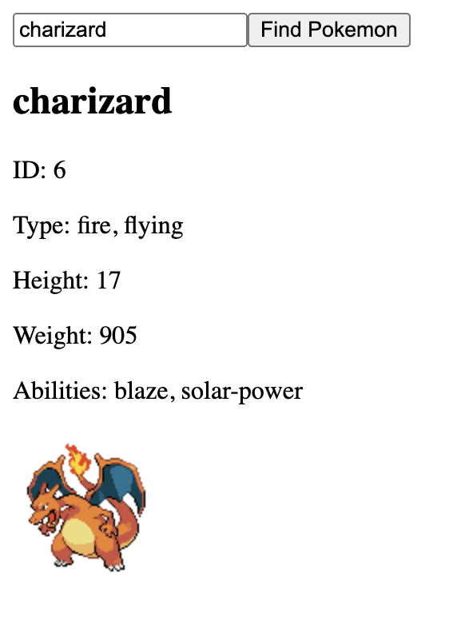

# Pokemon Interview Task

Getting data from the [Pokémon API] (https://pokeapi.co/)

Simple FastAPI app. Run with `uvicorn get_pokemon:app --reload`

Then go to `http://127.0.0.1:8000/pokemon/{pokemon_name}`

### Docker
1. run Docker app
2. then build with `docker build -t pokemon .`
3. then run with `docker run -d -p 8000:8000 fastapi-pokemon-app`
4. then go to `http://localhost:8000/pokemon/{pokemon_name}`
5. Deleting the container `docker rm -f $(docker ps -a -q)` | view all containers `docker ps -a`

### Pokemon App Python 
1. run `uvicorn get_pokemon:app --reload`
2. run `python3 pokemon_app.py`

example:

### Pokemon App React
1. run `uvicorn get_pokemon:app --reload`
2. open index.html with live server

example:

